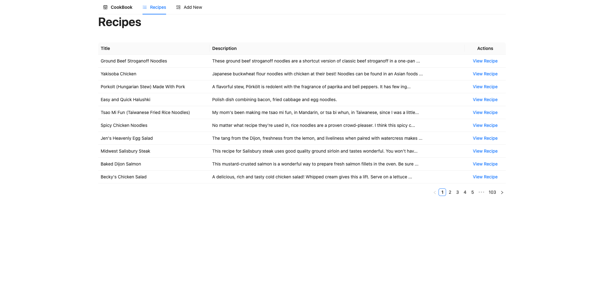
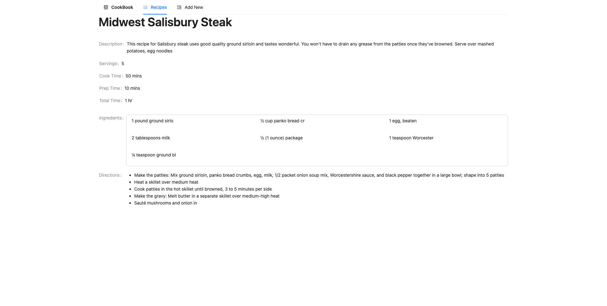
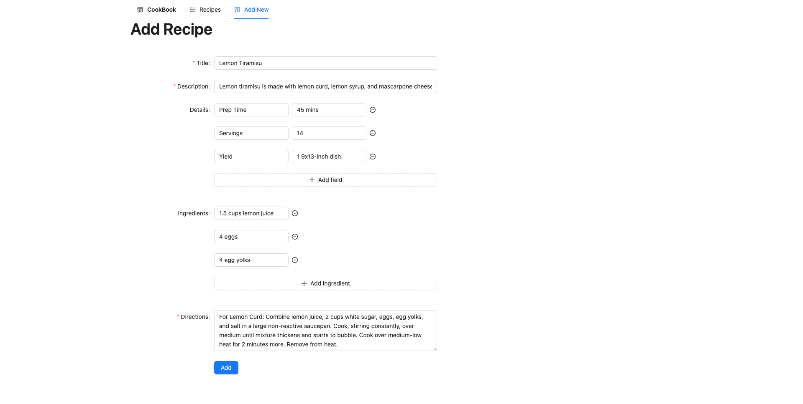

# CookBook

## What is CookBook ?

It is a CRM to manage restaurants and recipes. User can:

* List of available recipes.
* See detailed view of a recipe.
* Add a new Recipe

## How to Setup and Run ?

1. Run the initial setup: `make docker_setup`
2. Create the migrations: `make docker_makemigrations`
3. Run the migrations: `make docker_migrate`
4. Scrape and Populate: `make docker_populate`
5. Run the project: `make docker_up`
6. Access http://localhost:8000 on your browser and the project should be running there
7. To access the logs for each service, run: make `docker_logs <service name>` (either `backend`, `frontend`, etc)
8. To stop the project, run: `make docker_down`

## How to make it Production Ready ?

1. Add test for scraping recipes.
2. Add API tests for CRUD operations.
3. Add frontend tests.
4. Setup cron jobs to scrape recipes.
5. Setting up a CI/CD pipeline.

## How does the Web Scraper works ?

The webscraper will scrape https://www.allrecipes.com/ for recipe pages available. Although the website contains over
10,000 recipes, we can decide how many recipes we want to scrape. The scraper starts at the main page and looks through
all the links that are listed on the page, of which it filters out Recipe List urls and the Recipe Detail urls. The
scraper uses [Depth First Search](https://en.wikipedia.org/wiki/Depth-first_search) to crawl through the whole website and scrape the Recipe List urls to find Recipe
Details urls. At the end it parses through all the Recipe Detail Urls to capture the data and store in the database.

## How can we make CookBook better ?

1. The CookBook scraper extracts the text from the Recipe Detail web page and stores it in the database. We can apply
   [Natural Language Processing](https://en.wikipedia.org/wiki/Natural_language_processing) techniques to break down the text into further details which can be helpful to eliminate
   redundant data storage. Examples:

   _½ cup diced onion_ : `{   
   "ingredient": "Onion",
   "quantity": 0.5,
   "unit": "cup",
   "cut": "diced"
   }`

   _2 ½ cups egg noodles_ : `{
   "ingredient": "Egg Noodles",
   "quantity": 2.5,
   "unit": "cup"
   }`

   _2 tablespoons vodka_ : `{
   "ingredient": "Vodka",
   "quantity": 2,
   "unit": "tablespoon"
   }`

   _4 (4 ounce) salmon fillets_ : `{
   "ingredient": "Salmon",
   "quantity": 4,
   "unit": "ounce",
   "cut": "fillet"
   }`

2. CookBook uses a SQL data storage but this applies limitation for the structure of data, and size of texts it can
   store. Using a NoSQL database would be big help for storing data in without worrying about missing out on data loss
   and will help extend CookBook to scrape and store data from different websites and source without worrying too much
   about the schema.

3. We can use Airflow or similar tools to schedule scraping of data from different sources at regular intervals.

## What is the Tech Stack ?

1. [Django](https://www.djangoproject.com/) for the backend.
2. [Django Rest Framework](https://www.django-rest-framework.org/) to create APIs.
3. [PostgreSQL](https://www.postgresql.org/) to store data.
4. [React](https://react.dev/) for frontend.
5. [Ant Design](https://ant.design/) for UI components.
6. [Ant Design Icons](https://ant.design/components/icon) for Icons.

## What are the Limitations ?

Using SQL database requires to define a schema for the models and thus setting a maximum length for CharField in Django.
This requires the trimming of the scraped and parsed data and thus can display data which might be incomplete or might
not makes sense. The following are the maximum length of characters that can be stored for different Models and fields.

```yaml
Recipe:
    title: 100
    description: 200
    directions: 400

Ingredient:
    name: 20

Restaurant:
    name: 20
    address: 40
    city: 10

Dish:
    name: 10
```

## How does it look ?

1. Recipe List 
2. Recipe Detail 
3. Add Recipe 
